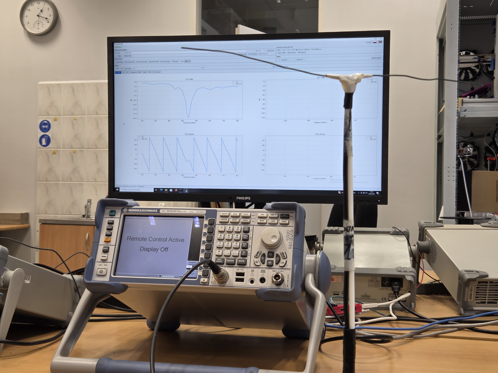
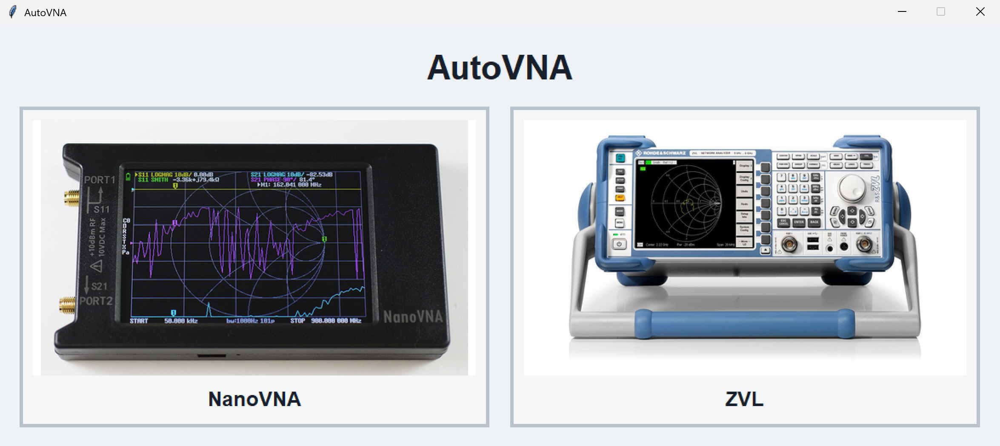
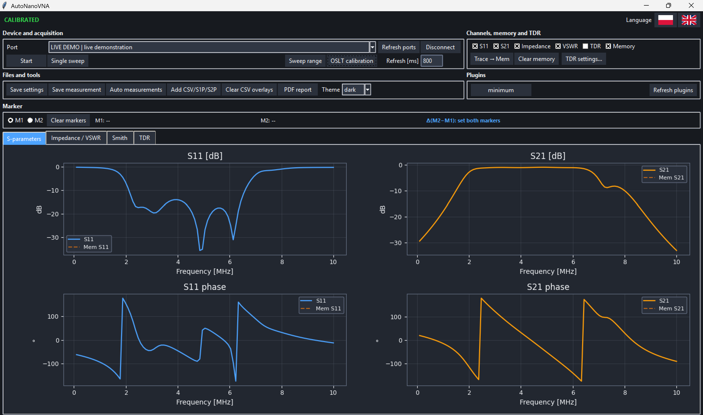
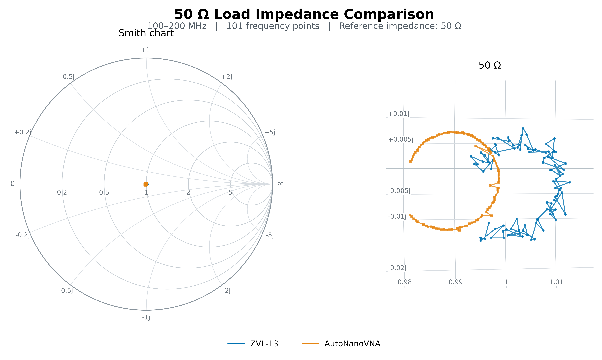
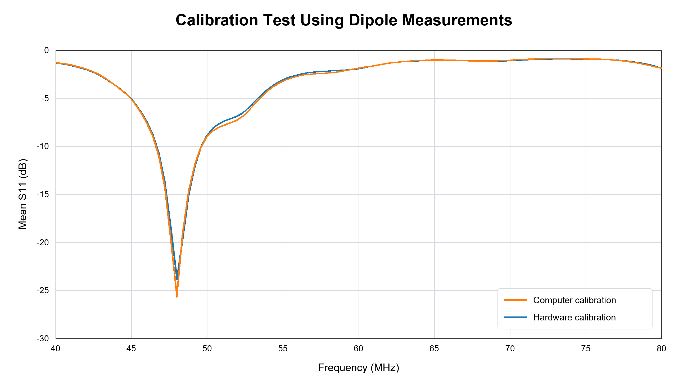
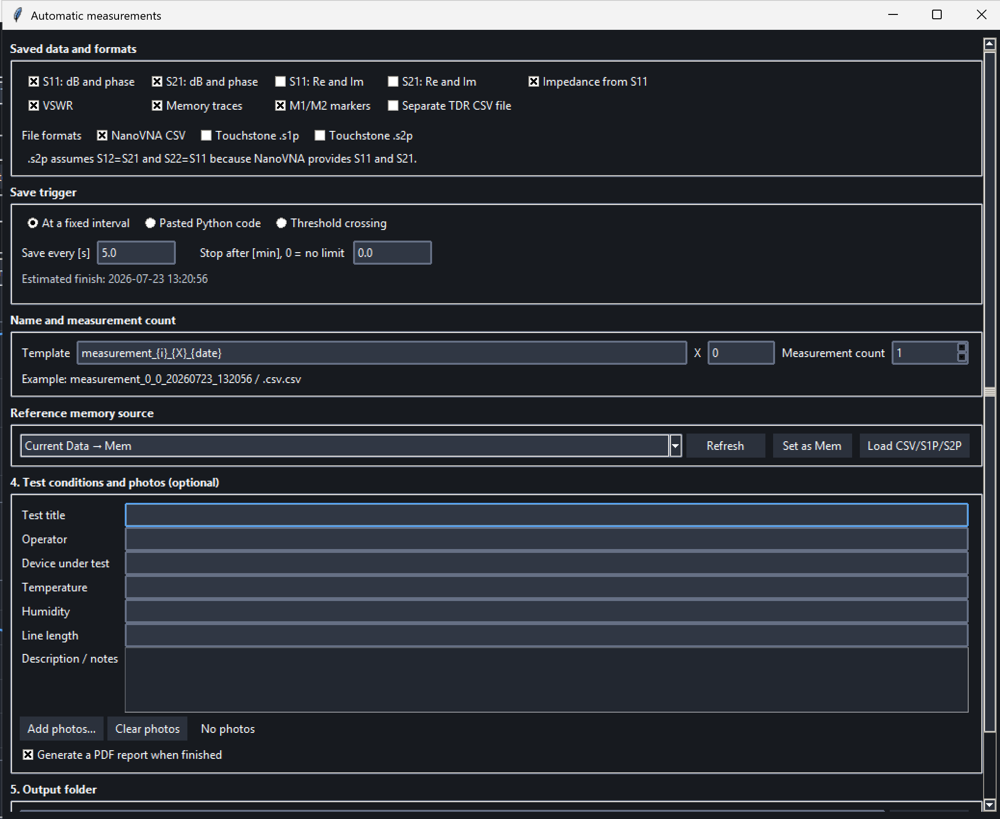
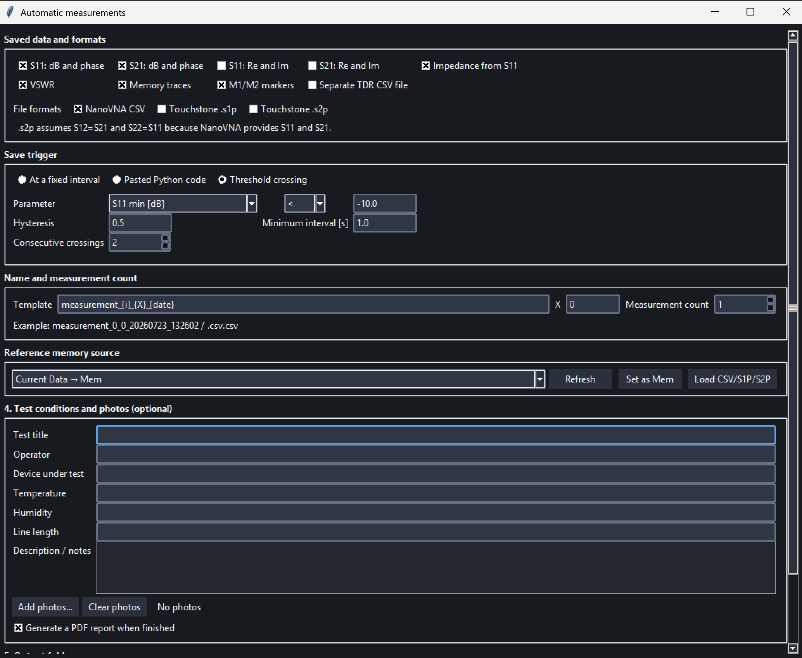
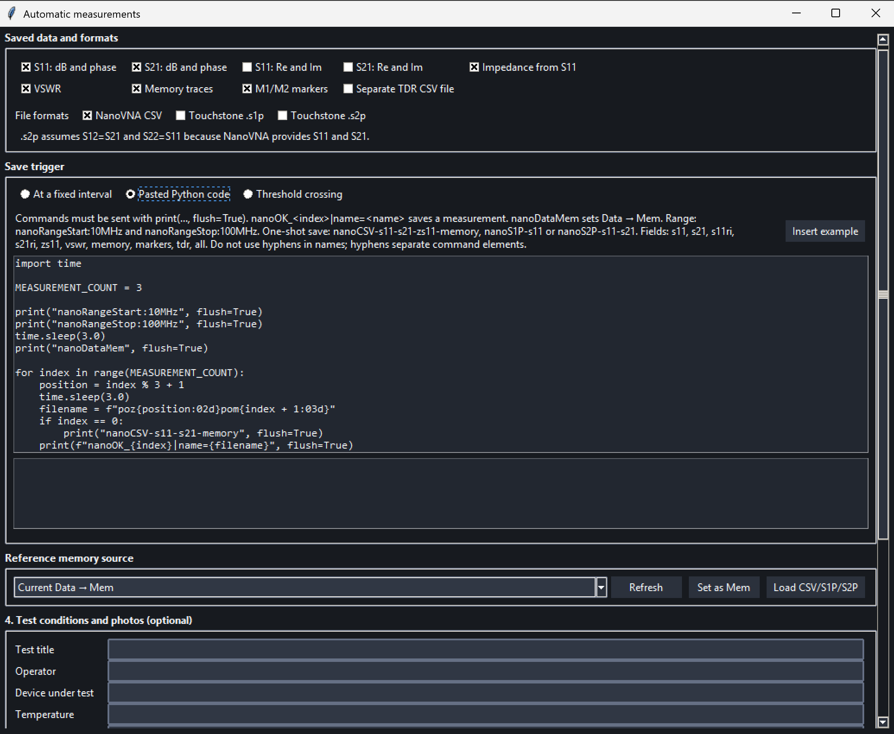

# AutoVNA

[Polska wersja](README_PL.md)

**AutoVNA** is a shared package containing two desktop applications designed to operate vector network analyzers:

- **AutoNanoVNA** — support for NanoVNA analyzers through an USB emulated serial port;
- **AutoRSVNA** — support for the Rohde & Schwarz ZVL-13 analyzer through LAN.

Both applications are launched from one shared **AutoVNA launcher**. The launcher allows the user to select the required module, checks the required Python libraries, and installs missing dependencies before starting the application when necessary.

The applications have a similar interface and a common workflow: connecting to the analyzer, setting the frequency range, calibration, performing measurements, analyzing plots, automatically saving data, and running plugins.

> **AutoNanoVNA:** version 1.0  
> **AutoRSVNA:** version 1.0

---

## Table of contents

 1. [General description](#1-general-description)
 2. [Supported devices](#2-supported-devices)
 3. [Requirements and libraries](#3-requirements-and-libraries)
 4. [Installation and startup](#4-installation-and-startup)
 5. [Interface and measurement functions](#5-interface-and-measurement-functions)
 6. [Calibration](#6-calibration)
 7. [Automatic measurements](#7-automatic-measurements)
 8. [Controlling measurements from Python code](#8-controlling-measurements-from-python-code)
 9. [Plugins](#9-plugins)
10. [Saving and exporting results](#10-saving-and-exporting-results)
11. [Where the application stores data](#11-where-the-application-stores-data)
12. [Demo mode](#12-demo-mode)
13. [Troubleshooting](#13-troubleshooting)
14. [Limitations and safety](#14-limitations-and-safety)
15. [License](#15-license)

---

# 1. General description

AutoVNA is used to perform, display, and save measurements of the S-parameters of a device under test. Depending on the selected analyzer, the application can support:

- **S11** - reflection coefficient at port 1;
- **S21** - transmission from port 1 to port 2;
- **S12** - transmission from port 2 to port 1 in Auto RS VNA;
- **S22** - reflection coefficient at port 2 in Auto RS VNA.

The application provides, among other features:

- single and continuous measurements;
- frequency range and number-of-points settings;
- OSLT calibration;
- selection of measured S-parameters;
- magnitude, phase, and Smith chart display;
- impedance and VSWR calculations;
- TDR analysis;
- measurement markers;
- comparison of the current measurement with stored memory data;
- overlaying previously saved measurements;
- automatic measurement and saving of measurement series;
- export to CSV, S1P, S2P, and PDF;
- running custom plugins;
- light and dark themes;
- demo mode without a physical device.

# 2. Supported devices

## 2.1. AutoNanoVNA

The AutoNanoVNA module is intended for NanoVNA analyzers communicating through USB CDC serial port.

Exact compatibility may depend on the NanoVNA model and firmware. Before starting a long measurement series, perform a short connection and data-saving test.

## 2.2. AutoRSVNA

The AutoRSVNA module is intended for the Rohde & Schwarz ZVL-13 analyzer.

The application supports:

- S11;
- S21;
- S12;
- S22.

After connecting, the application sends the following query:

```text
*IDN?
```

and verifies the analyzer response.

An example of AutoRSVNA operating with a Rohde & Schwarz ZVL-13 analyzer is shown below. The software communicates with the analyzer over LAN, configures the measurement, and acquires S-parameter data displayed in the AutoVNA interface.



## 2.3. Module comparison

| Function                         | AutoNanoVNA                                                                               | AutoRSVNA |
|----------------------------------|-------------------------------------------------------------------------------------------|-----------|
|  USB/serial connection           |yes                                                                                       |       no    |
| LAN/TCP connection               | no                                                                                        | yes       |
| S11                              | yes                                                                                       | yes       |
| S21                              | yes                                                                                       | yes       |
| S12                              | no; `S12 = S21` is assumed in S2P files to maintain compatibility to maintain compatibility | yes       |
| S22                              | no; `S22 = S11` is assumed in S2P files to maintain compatibility to maintain compatibility | yes       |
| Host-side calibration            | yes                                                                                       | no        |
| Calibration performed by the VNA | yes, but not controlled by AutoNanoVNA                                                                                       | yes       |
| SCPI terminal                    | no                                                                                        | yes       |
| Automatic measurements           | yes                                                                                       | yes       |
| Python code control              | yes                                                                                       | yes       |
| CSV / S1P / S2P / PDF            | yes                                                                                       | yes       |
| TDR                              | yes                                                                                       | yes       |
| Plugins                          | yes                                                                                       | yes       |
| DEMO mode                        | yes                                                                                       | yes       |

---

# 3. Requirements and libraries

## 3.1. System requirements

- Windows or Linux operating system;
- Python 3.10 or newer for the source version;
- Tkinter;
- an available USB port for NanoVNA or a LAN connection for the ZVL-13;
- write permissions for the selected results directory.

## 3.2. Main Python libraries

```text
numpy>=1.24
pyserial>=3.5
matplotlib>=3.7
pandas>=2.0
scipy>=1.10
reportlab>=4.0
Pillow>=10.0
pyinstaller>=6.0
```

The libraries do not need to be installed manually one by one. During startup, the launcher checks the dependencies and automatically installs missing packages from the `requirements.txt` files.

## 3.3. Additional Linux requirements

Tkinter:

```bash
sudo apt install python3-tk
```

Access to the NanoVNA serial port:

```bash
sudo usermod -aG dialout "$USER"
```

After adding the user to the `dialout` group, log out and log in again.

---

# 4. Installation and startup

## 4.1. Installation

1. Download or clone the AutoVNA repository.
2. Extract it to a directory in which the user has write permissions.
3. Start the shared launcher.
4. The launcher checks whether Python and the required libraries are available.
5. Missing libraries are installed automatically.
6. After the check is complete, select the module corresponding to the connected analyzer.

## 4.2. Starting the launcher

### Windows

Run the launcher file:

```bat
AutoVNA.bat
```

### Linux

```bash
chmod +x AutoVNA.sh
./AutoVNA.sh
```

## 4.4. Launcher screenshot



---

# 5. Interface and measurement functions

## 5.1. Main application window



## 5.2. Connection panel

### AutoNanoVNA

1. Connect the NanoVNA using a USB cable that supports data transmission.
2. Click **Refresh ports**.
3. Select the correct COM port.
4. Click **Connect**.

### AutoRSVNA

1. Connect the computer and analyzer to the same LAN.
2. Read the IP address of the ZVL-13.
3. Enter the IP address in the host field.
4. Leave the default port `5025`, unless the device configuration uses another port.
5. Click **Connect**.

## 5.3. Frequency range

The user can set:

- start frequency;
- stop frequency;
- number of measurement points.

Units supported in the application and in the automation protocol:

```text
Hz
kHz
MHz
GHz
```

Changing the frequency range or the number of points may require a new calibration.

## 5.4. Selecting S-parameters

### AutoNanoVNA

Available parameters:

- S11;
- S21.

### AutoRSVNA

Available parameters:

- S11;
- S21;
- S12;
- S22.

Not all measurements need to be displayed at the same time. Enabling only the required measurements makes the plots clearer and can reduce the amount of saved data.

## 5.5. Starting and stopping a measurement

The main measurement buttons may include:

- **Start** - starts continuous measurements;
- **Stop** - stops periodic GUI updates;
- **Single measurement** - reads one complete data set.

Stopping GUI updates does not always stop the internal sweep of the physical analyzer. In AutoRSVNA, the analyzer may remain in `INIT:CONT ON` mode.

## 5.6. Magnitude and phase plots

The application can display:

- S-parameter magnitude in dB;
- phase in degrees;
- several active measurements at the same time;
- the current measurement and the measurement stored in memory;
- data loaded from a previously saved file.

The user can enable or disable selected plots to display only the required information.

## 5.7. Impedance and VSWR

For S11, the application can calculate impedance:

```text
Z = Z0 · (1 + S11) / (1 - S11)
```

and voltage standing wave ratio:

```text
VSWR = (1 + |S11|) / (1 - |S11|)
```

## 5.8. M1 and M2 markers

Markers are used to read values at selected points on a plot. The application can display, among other values:

- marker frequency;
- S-parameter value;
- phase;
- impedance;
- VSWR;
- frequency and value differences between M1 and M2.

Marker data can also be saved to a CSV file and used as a condition in threshold measurements.

## 5.10. Trace → Mem

The **Trace → Mem** button copies the current measurement to reference memory.

This function can be used to:

- compare a device under test before and after a change;
- observe differences relative to the initial measurement;
- save the current measurement as a reference for an automatic series;
- display the current measurement and memory data on the same plot.

The memory can be removed with the **Clear memory** button. Depending on the module, it may also be cleared after changing the frequency range or closing the application.

## 5.11. Overlaying previous measurements

The application allows the user to load a previous file and overlay its data on the current plots. The function can support:

- CSV;
- S1P;
- S2P.

Overlaying data is useful when comparing several samples, successive measurement stages, or results before and after changing a component.

Before comparing files, verify that they use compatible frequency ranges and numbers of points.

## 5.12. Save settings

Before saving a measurement, the user can select, among other options:

- output directory;
- file name;
- CSV, S1P, S2P, or PDF format;
- saved S-parameters;
- real and imaginary parts;
- impedance;
- VSWR;
- memory data;
- markers;
- TDR results.

During automatic measurements, the application can generate consecutive file names automatically or receive a file name from Python code.

## 5.13. TDR

TDR is calculated from frequency-domain data and provides an approximate analysis of impedance changes as a function of distance.

The result is affected by:

- bandwidth;
- number of points;
- frequency step;
- selected window;
- velocity factor `VF`.

Approximate distance relationship:

```text
d = c · VF · t / 2
```

TDR in the application is the result of a mathematical transformation and does not replace a dedicated real-time time-domain reflectometer.

## 5.14. SCPI terminal in AutoRSVNA

AutoRSVNA includes a terminal for manually sending SCPI commands.

Examples:

```text
*IDN?
SYSTem:ERRor?
INITiate:CONTinuous?
SENSe1:FREQuency:STARt?
```

A single line should contain no more than one query ending with `?`. This prevents multiple responses from being stored in the TCP queue.

## 5.15. Language and theme

The application supports:

- Polish language;
- English language;
- light theme;
- dark theme.

The selected settings are stored in the user configuration.

---

# 6. Calibration

Calibration should be performed with the cables, adapters, and frequency range that will be used during the actual measurement.

## 6.1. AutoNanoVNA calibration

Calibration is performed on the computer side using measurement data received from the NanoVNA, unless the hardware-side calibration on NanoVNA has been already performed (see 6.1.1).

For **S11**, a one-port OSL calibration is used with the following standards:

- OPEN;
- SHORT;
- LOAD.

For each frequency point, the relationship between the actual reflection coefficient **Γ** and the measured value **m** is described by a Möbius transformation:

$$
m = \\frac{a\\Gamma + b}{c\\Gamma + 1}
$$

Plain-text form:

```text
m = (a·Γ + b) / (c·Γ + 1)
```

where **a**, **b**, and **c** are complex calibration coefficients determined from the OPEN, SHORT, and LOAD measurements.

During a normal measurement, the inverse Möbius transformation is applied:

$$
\\Gamma = \\frac{m-b}{a-mc}
$$

Plain-text form:

```text
Γ = (m - b) / (a - m·c)
```

This allows the software to correct systematic **S11** measurement errors, including directivity, source match, and reflection tracking errors.

For **S21**, the following standard is used:

- THRU.

The measured **S21** response is normalized using the THRU measurement. This compensates for the frequency-dependent transmission response of the measurement path.

The calibration profile is associated with:

- the communication port or connected device;
- start frequency;
- stop frequency;
- number of sweep points.

The calibration coefficients are calculated separately for every frequency point. Therefore, changing the frequency range or the number of sweep points requires recalibration.

## 6.1.1. Hardware NanoVNA calibration

The calibration can be also performed on the NanoVNA itself, using its built-in procedure. There is no need to perform the AutoNanoVNA calibration in that case, since the data received by AutoNanoVNA in that case are already corrected.

## 6.2. AutoRSVNA calibration

AutoRSVNA starts calibration procedures performed by the ZVL-13 analyzer.

| Procedure               | Standards                         | Main use           |
|-------------------------|-----------------------------------|--------------------|
| P1 - full 1-port        | OPEN1, SHORT1, MATCH1             | S11                |
| P2 - full 1-port        | OPEN2, SHORT2, MATCH2             | S22                |
| P1 → P2 - 1-path 2-port | OPEN1, SHORT1, MATCH1, THRU       | S11, S21           |
| P1 ↔ P2 - full TOSM     | standards for both ports and THRU | S11, S21, S12, S22 |

During calibration, the application may temporarily stop the continuous sweep. After completion, cancellation, or an error, it should restore the previous measurement state.

## 6.3 Calibration verification

The AutoVNA calibration was verified using two separate tests. A 50 Ω load was measured and compared with the result obtained using a Rohde & Schwarz ZVL-13 analyzer. In a separate test, a dipole antenna was measured using AutoVNA computer-side calibration and compared with the result obtained using the analyzer’s hardware calibration. The results are presented below.



## 6.4. Calibration best practices

- do not change cables after calibration;
- do not move connectors during measurements;
- tighten connectors with the correct torque;
- use the correct calibration standards;
- If the calibration has been performed directly on the NanoVNA device, additional host-side calibration is not required, because Auto NanoVNA retrieves measurement data after the device calibration has already been applied.
- recalibrate after changing the frequency range;
- before a long series, verify the result using a known load.

---

# 7. Automatic measurements

The **Automatic measurements** window allows measurement series to be performed and saved without manually pressing the save button for every measurement.

Three modes are available:

1. timed measurement;
2. threshold measurement;
3. measurement controlled by Python code.

## 7.1. Main automatic measurement window



Typical common settings include:

- output directory;
- base file name;
- data format;
- selection of saved parameters;
- starting and stopping the series;
- completed measurement counter;
- status and error messages.

Before starting automation, perform a standard test measurement and verify that the selected directory is available.

## 7.2. Timed mode


Timed mode saves measurements at a defined time interval.

The user can set, among other options:

- interval between saves;
- number of measurements or total series duration;
- file format;
- base name;
- output directory.

Example applications:

- observing changes in a circuit during heating;
- aging tests;
- recording material changes over time;
- long-term monitoring of an antenna or sensor.

It is recommended to use an interval longer than the time required to complete a full sweep and save the file.

## 7.3. Threshold mode



Threshold mode saves a measurement only after a selected condition is met.

The condition may refer to:

- S11 value;
- S21 value;
- S12 or S22 in AutoRSVNA;
- impedance;
- VSWR;
- marker value;
- difference between markers M1 and M2.

Additional settings may include:

- threshold crossing direction;
- minimum time between consecutive saves;
- required number of consecutive threshold crossings;
- frequency point or active marker.

Example applications:

- saving data only after detecting contact with a sensor;
- recording the moment when a specified VSWR value is exceeded;
- saving data after a resonance-frequency change;
- detecting a change relative to the measurement stored in memory.

## 7.4. Python code mode



In this mode, the application starts user code as a separate Python process. The code can control an external measurement setup and send save commands to AutoVNA.

Possible applications:

- CNC control;
- moving a probe or positioner;
- stepper motor control;
- switching RF paths;
- controlling a measurement chamber;
- controlling a 3D printer using G-code;
- performing a measurement after moving to the next position.

Typical sequence:

```text
set the position of the external device
        ↓
wait for the setup to stabilize
        ↓
send the save command to AutoVNA
        ↓
save the latest complete measurement
        ↓
move to the next position
```

The code should use:

```python
print(..., flush=True)
```

Without `flush=True`, the message may remain in the buffer and may not be received immediately by the application.

## 7.5. Stopping an automatic measurement

After clicking **Stop**, the application should:

- stop creating new saved measurements;
- terminate or stop the automation process;
- preserve files that have already been created;
- unlock manual interface control.

Before disconnecting the analyzer or an external device, stop the automation first.

---

# 8. Controlling measurements from Python code

The protocol is available in both application versions. For compatibility with older scripts, the commands keep the `nano...` prefix, even in AutoRSVNA.

## 8.1. Saving the current measurement

```python
print("nanoOK_0|name=poz01pom001", flush=True)
```

`nanoOK_<index>` saves the latest complete measurement available in the application.

The index after `nanoOK_` should be unique within a measurement series.

The command does not immediately force a new sweep. The code should:

1. position the external device;
2. wait for the setup to stabilize;
3. send `nanoOK` only after stabilization.

## 8.2. Copying data to memory

```python
print("nanoDataMem", flush=True)
```

In AutoNanoVNA, the available S11 and S21 data are copied. In Auto RS VNA, S11, S21, S12, and S22 can be copied to memory.

## 8.3. Changing the frequency range

```python
print("nanoRangeStart:10MHz", flush=True)
print("nanoRangeStop:100MHz", flush=True)
```

Supported units:

```text
Hz
kHz
MHz
GHz
```

## 8.4. Selecting CSV fields

### AutoNanoVNA example

```python
print("nanoCSV-s11-s21-zs11-memory", flush=True)
print("nanoOK_1|name=measurement001", flush=True)
```

### AutoRSVNA example

```python
print("nanoCSV-s11-s21-s12-s22-memory", flush=True)
print("nanoOK_1|name=measurement001", flush=True)
```

Example commands:

| Command | Saved data                         |
|---------|------------------------------------|
| `s11`     | S11 in dB and phase                |
| `s21`     | S21 in dB and phase                |
| `s12`     | S12 in dB and phase in Auto RS VNA |
| `s22`     | S22 in dB and phase in Auto RS VNA |
| `s11ri`   | real and imaginary parts of S11    |
| `s21ri`   | real and imaginary parts of S21    |
| `s12ri`   | real and imaginary parts of S12    |
| `s22ri`   | real and imaginary parts of S22    |
| `zs11`    | impedance                          |
| `vswr`    | VSWR                               |
| `memory`  | measurements stored in memory      |
| `markers` | M1 and M2 markers                  |
| `tdr`     | separate TDR file                  |
| `all`     | all available fields               |

## 8.5. Saving S1P

```python
print("nanoS1P-s11", flush=True)
print("nanoOK_2|name=antenna001", flush=True)
```

## 8.6. Saving S2P

### AutoNanoVNA

```python
print("nanoS2P-s11-s21", flush=True)
print("nanoOK_3|name=filter001", flush=True)
```

NanoVNA directly measures S11 and S21. When saving S2P, the application assumes:

```text
S12 = S21
S22 = S11
```

### AutoRSVNA

```python
print("nanoS2P-s11-s21-s12-s22", flush=True)
print("nanoOK_3|name=filter001", flush=True)
```

In this case, the S2P file can contain the actually measured S11, S21, S12, and S22 parameters.

## 8.7. Several formats for one measurement

```python
print("nanoCSV-s11-s21-zs11", flush=True)
print("nanoS1P-s11", flush=True)
print("nanoS2P-s11-s21", flush=True)
print("nanoOK_4|name=measurement004", flush=True)
```

Format-selection commands apply only to the next valid `nanoOK`.

> Do not use hyphens in file names sent through the protocol because the hyphen separates command elements.

Valid names:

```text
poz01pom001
filter012
cable121
```

Invalid name:

```text
poz-01-pom-001
```

## 8.8 Full example

In the following example we demonstrate how to control an automated setup using a decomissioned 3D printer to apply force to the measured object in predetermined points. For each point of applied force a measurement is performed and the results of the sweep are saved to a separate file. The code works in Windows, for Linux one would have to change the serial port name.

```python
import serial
import time

SERIAL_PORT = "COM3"
BAUD_RATE = 250000

POSITIONS_X = [68, 84, 100, 122, 138, 154, 172]

def send_gcode(ser, command):
    print(command, flush=True)
    ser.write((command + "\n").encode("utf-8"))
    ser.flush()

    while True:
        response = ser.readline().decode(
            "utf-8", errors="replace"
        ).strip()

        if not response:
            continue

        response_lower = response.lower()

        if response_lower.startswith("ok"):
            return

        if (
            response_lower.startswith("error")
            or response_lower.startswith("!!")
        ):
            raise RuntimeError(
                f"Error {command}: {response}"
            )


def move(ser, command):
    send_gcode(ser, command)
    send_gcode(ser, "M400")


def main():
    ser = None

    try:
        ser = serial.Serial(
            SERIAL_PORT,
            BAUD_RATE,
        )

        time.sleep(2)
        ser.reset_input_buffer()

        # Move to the start position
        move(ser, "G28 X Y")
        send_gcode(ser, "G90")
        move(ser, "G1 X50 Y75 Z0")
        #save the current sweep result into reference memory
        print(f"nanoDataMem", flush=True)                                   #<--- command for the AutoVNA, save cuttent sweep to memory
        current_number = 1
        
        for position, x in enumerate(POSITIONS_X, start=1):
            #move actuator to certain position
            move(ser, f"G1 X{x}")
            time.sleep(2)
            #lower the actuator
            move(ser, "G1 Z-25")
            time.sleep(9)
            filename = f"position{position:02d}"
            #save the current sweep result into file 'filename'
            print("nanoCSV-s11-s21-zs11", flush=True)                        #<--- command for the AutoVNA, specify required columns for CSV file
            print("nanoS1P-s11", flush=True)                                 #<--- command for the AutoVNA, specify the required value for Touchstone S1P file
            print(f"nanoOK_{current_number}|name={filename}",flush=True)     #<--- command for the AutoVNA, perform the save of the fully acquired sweep
            current_number += 1
            time.sleep(2)
            move(ser, "G1 Z0")
        #go back to start position
        move(ser, "G1 Z0")
        move(ser, "G28 X Y")

        print(
            f"Finished. Executed {current_number} measurements.",
            flush=True
        )

    except serial.SerialException as error:
        print(f"Port error: {error}", flush=True)

    except RuntimeError as error:
        print(error, flush=True)

    finally:
        if ser is not None and ser.is_open:
            ser.close()


if __name__ == "__main__":
    main()
```

---

# 9. Plugins

The plugin system is independent of the measurement automation mechanism. Automation controls the measurement workflow, including timed measurements, condition-based triggering, and interaction with external devices through Python code. Plugins are implemented as separate Python .py files and are used for additional processing and analysis of already acquired measurement data. Each plugin receives a CSV snapshot of the current measurement as its input.

## 9.1. Separate installation for both modules

Each module has its own directory:

```text
AUTO_NanoVNA/plugins/
AUTO_RS_VNA/plugins/
```

A plugin intended for both versions must be copied separately to both directories. After adding or removing a file, click **Refresh plugins** in the relevant application.

Adding a plugin only to AutoNanoVNA does not make it available in AutoRSVNA, and vice versa.

## 9.2. How a plugin is started

The application runs the plugin as a separate process and passes two arguments:

```text
--input <CSV file containing the current measurement>
--output <results directory>
```

Before starting the plugin, the application creates a consistent snapshot of the current measurement. The plugin reads data from the input file and saves its results in the output directory.

## 9.3. Minimal plugin example

```python
import argparse
from pathlib import Path

parser = argparse.ArgumentParser()
parser.add_argument("--input", required=True)
parser.add_argument("--output", required=True)
args = parser.parse_args()

input_path = Path(args.input)
output_dir = Path(args.output)
output_dir.mkdir(parents=True, exist_ok=True)

result_path = output_dir / "result.txt"
result_path.write_text(
    input_path.read_text(encoding="utf-8"),
    encoding="utf-8",
)
```

## 9.4. Data compatibility

A plugin should check which columns are present in the received CSV file.

Keep in mind that:

- AutoNanoVNA directly provides mainly S11 and S21;
- AutoRSVNA can provide S11, S21, S12, and S22;
- the set of columns depends on the save settings;
- additional column names may depend on the selected module;
- a plugin requiring S12 or S22 will not work with real NanoVNA data without additional assumptions.

## 9.5. Included plugin example

The application includes the following example plugin:

```text
minimum.py
```

It is an **example of using the plugin system**, not a separate core function of AutoVNA.

The plugin shows how to:

- receive the current measurement as a CSV file;
- detect the CSV separator and measurement header automatically;
- locate the frequency, S11, and S21 columns;
- convert S11 and S21 magnitude and phase into complex values;
- process complex measurement data using NumPy;
- find the minimum magnitude of S11 and S21;
- determine the frequency at which each minimum occurs;
- display the calculated results in decibels;
- use command-line arguments provided by the application;
- select a CSV file manually when the plugin is started independently.

The plugin accepts the following command-line arguments:

```text
--input
```

Path to the CSV file containing the measurement data.

```text
--output
```

Path to the directory intended for plugin results.

The file must be placed separately in both modules:

```text
AUTO_NanoVNA/plugins/minimum.py
AUTO_RS_VNA/plugins/minimum.py
```

The example plugin analyzes the current S11 and S21 sweep. It searches for the lowest magnitude of each parameter and prints the corresponding frequency and value in decibels.

The plugin can be used as a simple starting point for developing custom measurement-analysis plugins.

## 9.6. Plugin security

A plugin is executable Python code and runs with the permissions of the user who started the application.

Only run plugins obtained from trusted sources.

---

# 10. Saving and exporting results

## 10.1. CSV

A CSV file can contain, among other fields:

```text
freq[Hz]
db:Trc1_S11
ang:Trc1_S11
db:Trc2_S21
ang:Trc2_S21
re:S11
im:S11
re:S21
im:S21
re:Z_S11
im:Z_S11
VSWR:S11
marker:M1
marker:M2
```

In AutoRSVNA, S12 and S22 data can also be saved.

Optionally, the following data can be saved:

- magnitude and phase;
- real and imaginary parts;
- impedance;
- VSWR;
- memory data;
- markers;
- TDR data.

## 10.2. Touchstone S1P

An `.s1p` file contains the complex S11 parameter.

## 10.3. Touchstone S2P

Standard data order:

```text
S11, S21, S12, S22
```

AutoRSVNA can save all four actually measured parameters when they are enabled.

In AutoNanoVNA, the following assumptions are used to preserve compatibility with AutoRSVNA export data:

```text
S12 = S21
S22 = S11
```

This assumes reciprocity and symmetry of the device under test. Keep this in mind when interpreting asymmetric two-port networks.

## 10.4. PDF report

A PDF report can contain:

- measurement information;
- selected frequency range;
- active S-parameters;
- plots;
- markers;
- basic calculated values;
- TDR data, when enabled.

Before saving a report, verify that all required plots are visible and that a current measurement has been completed.

---

# 11. Where the application stores data

Measurement files, reports, and plugin results are saved in the directory selected by the user.

## 11.1. AutoNanoVNA configuration

Windows:

```text
%APPDATA%\AUTO_NanoVNA
```

Linux:

```text
~/.config/AUTO_NanoVNA
```

The directory can contain:

```text
settings.json
automation_code.py
calibrations/
```

## 11.2. AutoRSVNA configuration

Windows:

```text
%APPDATA%\AUTO_RS_VNA\settings.json
```

Linux:

```text
~/.config/AUTO_RS_VNA/settings.json
```

It is recommended to save measurement results outside the application directory, for example in a separate project directory.

---

# 12. Demo mode

DEMO mode allows the interface to be started without a physical analyzer.

To start it:

1. start the shared launcher;
2. select AutoNanoVNA or AutoRSVNA;
3. select `DEMO` in the device field or enter `demo`;
4. click **Connect**.

In AutoNanoVNA, `DEMO` replaces the COM port. In AutoRSVNA, it replaces the analyzer IP address.

Demo mode can be used to:

- learn the interface;
- test the plots;
- test save settings;
- demonstrate the application;
- perform basic plugin and report tests.

DEMO mode does not replace testing with a physical analyzer and must not be used to evaluate metrological accuracy.

---

# 13. Troubleshooting

## 13.1. The launcher does not start the application

- start the launcher from the main AutoVNA directory;
- verify that both module directories are located next to the launcher;
- check the Internet connection during the first dependency installation;
- review the dependency installation messages;
- try running the launcher as a user with write permissions for the directory.

## 13.2. Libraries are not installed automatically

Try installing them manually:

```bash
pip install -r AUTO_NanoVNA/requirements.txt
pip install -r AUTO_RS_VNA/requirements.txt
```

## 13.3. NanoVNA does not appear in the port list

- verify that the USB cable supports data transmission;
- check Device Manager;
- close other applications using the port;
- click **Refresh ports**;
- on Linux, verify membership in the `dialout` group.

## 13.4. `module 'serial' has no attribute 'Serial'` error

Remove the incorrect `serial` package and install `pyserial`:

```bat
py -m pip uninstall -y serial
py -m pip uninstall -y pyserial
py -m pip install --force-reinstall pyserial
```

## 13.5. No connection to the ZVL-13

Check:

- analyzer IP address;
- port `5025`;
- firewall settings;
- whether the computer and ZVL are connected to the same network;
- response to `ping`;
- response to `*IDN?`.

## 13.6. All data values are zero

- verify that the sweep is running;
- wait for the first sweep to finish;
- repeat the measurement;
- check the selected S-parameters;
- in Auto RS VNA, read the error queue using `SYSTem:ERRor?`.

## 13.7. Python code does not save a measurement

Verify that the command is printed by the process started from the automatic measurement window:

```python
print("nanoOK_0|name=measurement001", flush=True)
```

Text entered manually in a separate terminal is not received by the application.

## 13.8. A plugin does not appear in the application

- check the `plugins/` directory of the correct module;
- remember that plugins are installed separately for AutoNanoVNA and Auto RS VNA;
- click **Refresh plugins**;
- check that the file has the `.py` extension;
- review the startup log.

## 13.9. DEMO mode does not start

- select or enter `DEMO` or `demo` in the device field;
- do not enter an IP address or COM port number at the same time;
- click **Connect**;
- start the latest version of the selected module.

---

# 14. Limitations and safety

- AutoVNA is not a certified metrological system;
- the application is not a universal driver for all VNA analyzers;
- NanoVNA compatibility depends on the model and firmware;
- the described AutoRSVNA version is intended for the ZVL-13;
- NanoVNA host-side calibration is simplified;
- NanoVNA S2P export uses symmetry and reciprocity assumptions;
- TDR depends on bandwidth, number of points, window, and `VF`;
- plugins and automation code run with the user's permissions;
- automatic control of mechanical devices requires appropriate safety precautions;
- a DEMO mode test does not replace a measurement with a physical device.

Before starting a long automatic series:

1. perform several test measurements;
2. verify the calibration;
3. check the output directory and file names;
4. verify the operation of the Stop button;
5. test the movement of external devices;
6. make sure that the setup can operate safely without continuous supervision.

---

# 15. License

BSD-3-Clause
