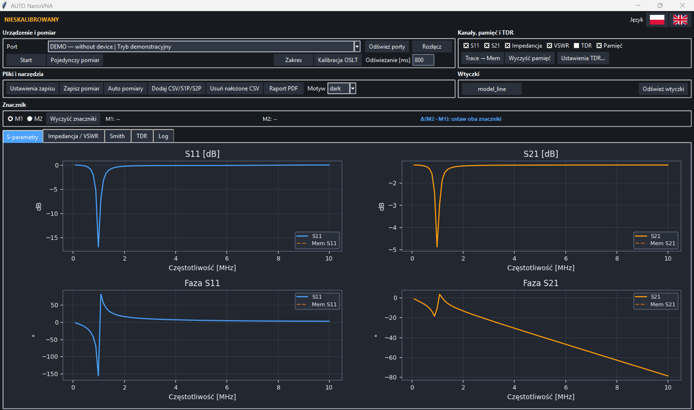
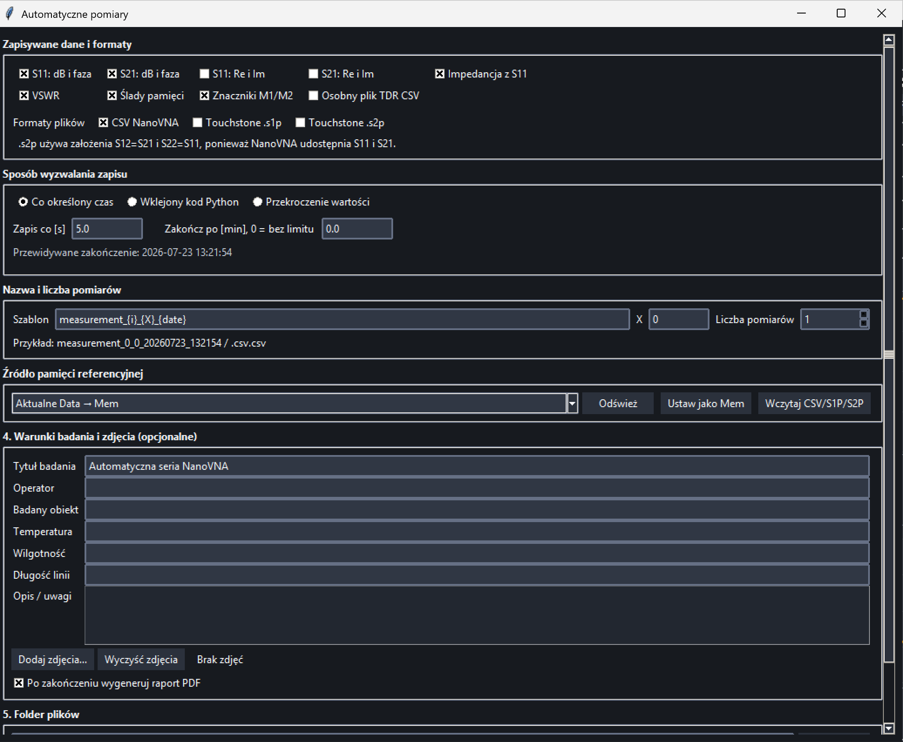
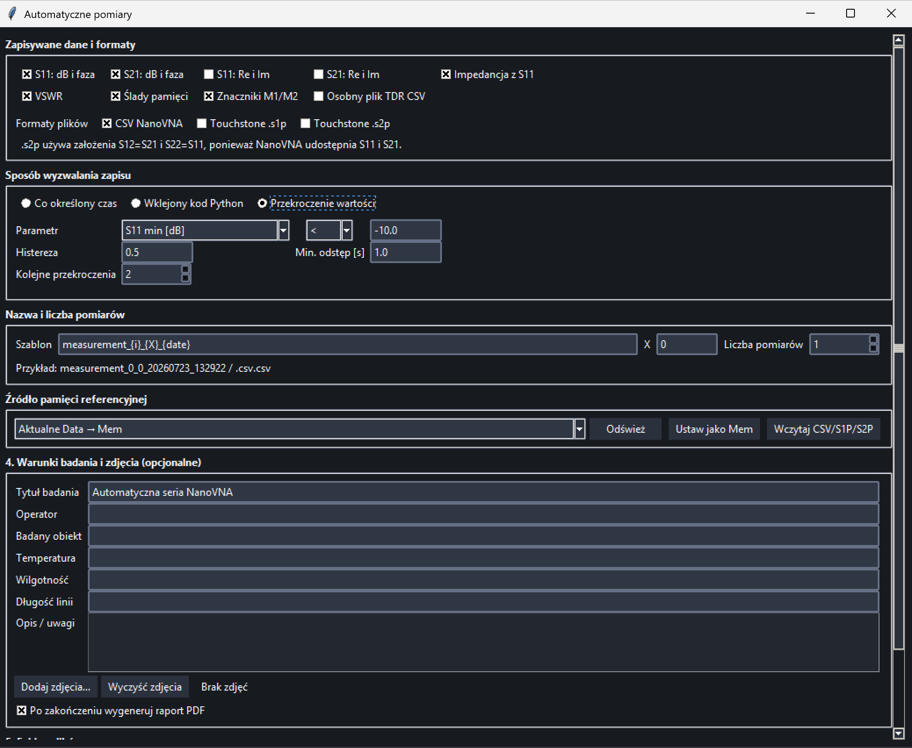
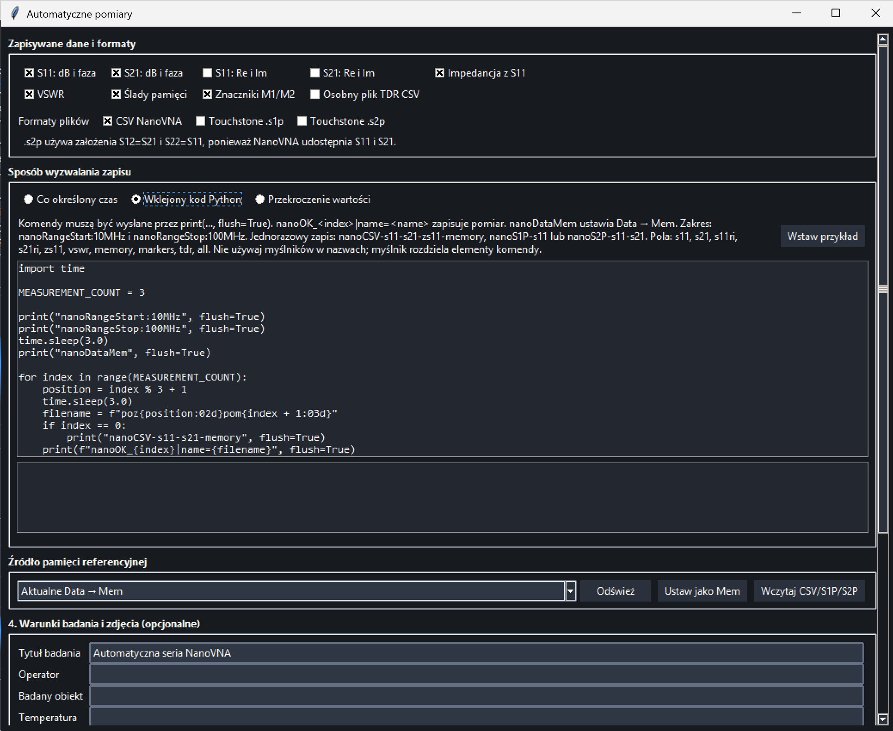

# AutoVNA

[English version](README.md)

**AutoVNA** jest wspólnym pakietem dwóch aplikacji desktopowych przeznaczonych do obsługi wektorowych analizatorów sieci:

- **AutoNanoVNA** — obsługa analizatorów NanoVNA przez emulowany port szeregowy USB;
- **AutoRSVNA** — obsługa analizatora Rohde & Schwarz ZVL-13 przez sieć LAN

Oba programy są uruchamiane z jednego, wspólnego **launchera AutoVNA**. Launcher pozwala wybrać właściwy moduł, sprawdza wymagane biblioteki Pythona i w razie potrzeby instaluje brakujące zależności przed uruchomieniem programu.

Programy mają podobny interfejs oraz wspólny sposób pracy: połączenie z analizatorem, ustawienie zakresu, kalibracja, wykonanie pomiaru, analiza wykresów, automatyczny zapis danych i uruchamianie wtyczek.

> **AutoNanoVNA:** wersja 1.0
> **AutoRSVNA:** wersja 1.0

---

## Spis treści

 1. [Opis ogólny](#1-opis-og%C3%B3lny)
 2. [Obsługiwane urządzenia](#2-obs%C5%82ugiwane-urz%C4%85dzenia)
 3. [Wymagania i biblioteki](#3-wymagania-i-biblioteki)
 4. [Instalacja i uruchomienie](#4-instalacja-i-uruchomienie)
 5. [Interfejs i funkcje pomiarowe](#5-interfejs-i-funkcje-pomiarowe)
 6. [Kalibracja](#6-kalibracja)
 7. [Automatyczne pomiary](#7-automatyczne-pomiary)
 8. [Sterowanie pomiarem z kodu Python](#8-sterowanie-pomiarem-z-kodu-python)
 9. [Wtyczki](#9-wtyczki)
10. [Zapis i eksport wyników](#10-zapis-i-eksport-wynik%C3%B3w)
11. [Gdzie program zapisuje dane](#11-gdzie-program-zapisuje-dane)
12. [Tryb demonstracyjny](#12-tryb-demonstracyjny)
13. [Rozwiązywanie problemów](#13-rozwi%C4%85zywanie-problem%C3%B3w)
14. [Ograniczenia i bezpieczeństwo](#14-ograniczenia-i-bezpiecze%C5%84stwo)
15. [Licencja](#15-licencja)

---

# 1. Opis ogólny

AutoVNA służy do wykonywania, prezentowania i zapisywania pomiarów parametrów S badanego obiektu. W zależności od wybranego analizatora program może obsługiwać:

- **S11** - współczynnik odbicia na porcie 1;
- **S21** - transmisję z portu 1 do portu 2;
- **S12** - transmisję z portu 2 do portu 1 w AutoRSVNA;
- **S22** - współczynnik odbicia na porcie 2 w AutoRSVNA.

Program umożliwia między innymi:

- wykonywanie pomiarów pojedynczych i ciągłych;
- ustawianie zakresu częstotliwości i liczby punktów;
- kalibrację OSLT;
- wybór mierzonych parametrów S;
- wyświetlanie modułu, fazy i wykresu Smitha;
- obliczanie impedancji i VSWR;
- analizę TDR;
- używanie markerów pomiarowych;
- porównywanie aktualnego pomiaru z pamięcią;
- nakładanie wcześniej zapisanych pomiarów;
- automatyczne wykonywanie i zapisywanie serii pomiarów;
- eksport do CSV, S1P, S2P i PDF;
- uruchamianie własnych wtyczek;
- wybór jasnego albo ciemnego motywu;
- uruchomienie trybu demonstracyjnego bez urządzenia.

# 2. Obsługiwane urządzenia

## 2.1. AutoNanoVNA

Moduł AutoNanoVNA jest przeznaczony do analizatorów NanoVNA komunikujących się przez port szeregowy USB CDC.

Dokładna zgodność może zależeć od modelu NanoVNA i zastosowanego firmware. Przed rozpoczęciem długiej serii pomiarowej należy wykonać krótki test połączenia i zapisu danych.

## 2.2. AutoRSVNA

Moduł AutoRSVNA jest przeznaczony do analizatora Rohde & Schwarz ZVL-13.

Program obsługuje:

- S11;
- S21;
- S12;
- S22.

Po połączeniu program wysyła zapytanie:

```text
*IDN?
```

i sprawdza odpowiedź analizatora.

Poniżej przedstawiono przykład działania AutoRSVNA z analizatorem Rohde & Schwarz ZVL-13. Oprogramowanie komunikuje się z analizatorem przez sieć LAN, konfiguruje pomiar i pobiera dane parametrów S wyświetlane w interfejsie AutoVNA.


## 2.3. Porównanie modułów

| Funkcja                         | AutoNanoVNA                     | AutoRSVNA |
|---------------------------------|----------------------------------|-------------|
| Połączenie USB/port szeregowy              | tak                              | nie         |
| Połączenie LAN/TCP              | nie                              | tak         |
| S11                             | tak                              | tak         |
| S21                             | tak                              | tak         |
| S12                             | nie; w plikach S2P przyjmowane `S12 = S21` w celu zachowania zgodności | tak         |
| S22                             | nie; w plikach S2P przyjmowane `S22 = S11` w celu zachowania zgodności | tak         |
| Kalibracja po stronie komputera | tak                              | nie         |
| Kalibracja wykonywana przez VNA | nie                              | tak         |
| Terminal SCPI                   | nie                              | tak         |
| Pomiary automatyczne            | tak                              | tak         |
| Sterowanie kodem Python         | tak                              | tak         |
| CSV / S1P / S2P / PDF           | tak                              | tak         |
| TDR                             | tak                              | tak         |
| Wtyczki                         | tak                              | tak         |
| Tryb DEMO                       | tak                              | tak         |

---

# 3. Wymagania i biblioteki

## 3.1. Wymagania systemowe

- System operacyjny Windows lub Linux;
- Python 3.10 lub nowszy dla wersji źródłowej;
- Tkinter;
- wolny port USB dla NanoVNA albo połączenie LAN dla ZVL-13;
- uprawnienia do zapisu w wybranym katalogu wyników.

## 3.2. Główne biblioteki Python

```text
numpy>=1.24
pyserial>=3.5
matplotlib>=3.7
pandas>=2.0
scipy>=1.10
reportlab>=4.0
Pillow>=10.0
pyinstaller>=6.0
```

Nie trzeba instalować każdej biblioteki ręcznie. Podczas uruchamiania launcher sprawdza zależności i automatycznie instaluje brakujące pakiety z plików `requirements.txt`.

## 3.3. Dodatkowe wymagania w Linux

Tkinter:

```bash
sudo apt install python3-tk
```

Dostęp do portu szeregowego NanoVNA:

```bash
sudo usermod -aG dialout "$USER"
```

Po dodaniu użytkownika do grupy `dialout` należy się wylogować i ponownie zalogować.

---

# 4. Instalacja i uruchomienie

## 4.1. Instalacja

1. Pobierz lub sklonuj repozytorium AutoVNA.
2. Rozpakuj je do katalogu, w którym użytkownik ma prawa zapisu.
3. Uruchom wspólny launcher.
4. Launcher sprawdzi dostępność Pythona i wymaganych bibliotek.
5. Brakujące biblioteki zostaną zainstalowane automatycznie.
6. Po zakończeniu kontroli wybierz moduł odpowiedni dla analizatora.

## 4.2. Uruchomienie launchera

### Windows

Uruchom plik launchera,

```bat
AutoVNA.bat
```

### Linux

```bash
chmod +x AutoVNA.sh
./AutoVNA.sh
```

## 4.4. Zrzut ekranu launchera


---

# 5. Interfejs i funkcje pomiarowe

## 5.1. Główne okno programu



## 5.2. Panel połączenia

### AutoNanoVNA

1. Podłącz NanoVNA przewodem USB z transmisją danych.
2. Kliknij **Odśwież porty**.
3. Wybierz właściwy port COM.
4. Kliknij **Połącz**.

### AutoRSVNA

1. Podłącz komputer i analizator do tej samej sieci LAN.
2. Odczytaj adres IP ZVL-13.
3. Wpisz adres IP w polu hosta.
4. Pozostaw domyślny port `5025`, chyba że konfiguracja urządzenia jest inna.
5. Kliknij **Połącz**.

## 5.3. Zakres częstotliwości

Użytkownik może ustawić:

- częstotliwość początkową;
- częstotliwość końcową;
- liczbę punktów pomiarowych.

Obsługiwane jednostki wpisywane w programie lub w protokole automatyzacji:

```text
Hz
kHz
MHz
GHz
```

Zmiana zakresu częstotliwości lub liczby punktów może wymagać wykonania nowej kalibracji.

## 5.4. Wybór parametrów S

### AutoNanoVNA

Dostępne są:

- S11;
- S21.

### AutoRSVNA

Dostępne są:

- S11;
- S21;
- S12;
- S22.

Nie trzeba wyświetlać wszystkich pomiarów. Włączenie tylko potrzebnych pomiarów upraszcza wykresy i może zmniejszyć ilość zapisywanych danych.

## 5.5. Uruchamianie i zatrzymywanie pomiaru

Główne przyciski pomiarowe mogą obejmować:

- **Start** - uruchomienie pomiaru ciągłego;
- **Stop** - zatrzymanie cyklicznego odświeżania;
- **Pojedynczy pomiar** - pobranie jednego kompletnego zestawu danych;

Zatrzymanie odświeżania w GUI nie zawsze oznacza zatrzymanie wewnętrznego sweepu fizycznego analizatora. W AutoRSVNA program może nadal pozostawić analizator w trybie `INIT:CONT ON`.

## 5.6. Wykres modułu i fazy

Program może prezentować:

- moduł parametru S w dB;
- fazę w stopniach;
- kilka aktywnych pomiarów jednocześnie;
- pomiar aktualny i pomiar zapisany w pamięci;
- dane wczytane z wcześniejszego pliku.

Użytkownik może włączać i wyłączać wybrane wykresy, aby wyświetlić tylko potrzebne informacje.

## 5.7. Impedancja i VSWR

Dla S11 program może obliczać impedancję:

```text
Z = Z0 · (1 + S11) / (1 - S11)
```

oraz współczynnik fali stojącej:

```text
VSWR = (1 + |S11|) / (1 - |S11|)
```

## 5.8. Markery M1 i M2

Markery służą do odczytywania wartości w wybranych punktach wykresu. Program może pokazywać między innymi:

- częstotliwość markera;
- wartość parametru S;
- fazę;
- impedancję;
- VSWR;
- różnicę częstotliwości i wartości pomiędzy M1 i M2.

Markery mogą również zostać zapisane do pliku CSV i użyte jako warunek w pomiarze progowym.

## 5.10. Trace → Mem

Przycisk **Trace → Mem** kopiuje aktualny pomiar do pamięci referencyjnej.

Funkcja może służyć do:

- porównania badanego obiektu przed i po zmianie;
- obserwacji różnicy względem pomiaru początkowego;
- zapisania aktualnego śladu jako referencji dla serii automatycznej;
- pokazania bieżącego pomiaru i pamięci na jednym wykresie.

Pamięć można usunąć przyciskiem **Wyczyść pamięć**. W zależności od modułu może zostać również wyczyszczona po zmianie zakresu lub zamknięciu programu.

## 5.11. Nakładanie wcześniejszych pomiarów

Program pozwala wczytać wcześniejszy plik i nałożyć jego dane na aktualne wykresy. Funkcja może obsługiwać:

- CSV;
- S1P;
- S2P.

Nakładanie danych jest przydatne podczas porównywania kilku próbek, kolejnych etapów pomiarów albo wyników przed i po zmianie elementu.

Przed porównaniem należy sprawdzić, czy pliki mają zgodny zakres częstotliwości i liczbę punktów.

## 5.12. Ustawienia zapisu

Przed zapisaniem pomiaru można wybrać między innymi:

- folder wynikowy;
- nazwę pliku;
- format CSV, S1P, S2P lub PDF;
- zapisywane parametry S;
- części rzeczywiste i urojone;
- impedancję;
- VSWR;
- pamięć;
- markery;
- wyniki TDR.

W automatycznych pomiarach program może sam tworzyć kolejne nazwy plików albo otrzymywać nazwę z kodu Python.

## 5.13. TDR

TDR jest obliczane z danych częstotliwościowych i umożliwia przybliżoną analizę zmian impedancji w funkcji odległości.

Na wynik wpływają:

- szerokość pasma;
- liczba punktów;
- krok częstotliwości;
- zastosowane okno;
- współczynnik prędkości `VF`.

Przybliżona zależność odległości:

```text
d = c · VF · t / 2
```

TDR w programie jest wynikiem przekształcenia matematycznego i nie zastępuje dedykowanego reflektometru czasu rzeczywistego.

## 5.14. Terminal SCPI w AutoRSVNA

AutoRSVNA posiada terminal umożliwiający ręczne wysyłanie komend SCPI.

Przykłady:

```text
*IDN?
SYSTem:ERRor?
INITiate:CONTinuous?
SENSe1:FREQuency:STARt?
```

W jednym wierszu należy umieszczać maksymalnie jedno zapytanie zakończone znakiem `?`. Zapobiega to pozostawieniu kilku odpowiedzi w kolejce TCP.

## 5.15. Język i motyw

Program obsługuje:

- język polski;
- język angielski;
- motyw jasny;
- motyw ciemny.

Wybrane ustawienia są zapisywane w konfiguracji użytkownika.

---

# 6. Kalibracja

Kalibrację należy wykonać dla przewodów, przejściówek i zakresu częstotliwości używanego podczas właściwego pomiaru.

## 6.1. Kalibracja AutoNanoVNA

Kalibracja jest wykonywana po stronie komputera na podstawie danych pomiarowych odebranych z NanoVNA, chyba że wcześniej wykonano kalibrację sprzętową bezpośrednio w NanoVNA (patrz 6.1.1).

Dla **S11** stosowana jest jednoportowa kalibracja OSL wykorzystująca następujące wzorce:

- OPEN;
- SHORT;
- LOAD.

Dla każdego punktu częstotliwości zależność pomiędzy rzeczywistym współczynnikiem odbicia **Γ** a wartością zmierzoną **m** jest opisana za pomocą transformacji Möbiusa:

$$
m = \frac{a\Gamma + b}{c\Gamma + 1}
$$

Zapis tekstowy:

```text
m = (a·Γ + b) / (c·Γ + 1)
```

gdzie **a**, **b** oraz **c** są zespolonymi współczynnikami kalibracyjnymi wyznaczanymi na podstawie pomiarów OPEN, SHORT i LOAD.

Podczas normalnego pomiaru stosowana jest odwrotna transformacja Möbiusa:

$$
\Gamma = \frac{m-b}{a-mc}
$$

Zapis tekstowy:

```text
Γ = (m - b) / (a - m·c)
```

Pozwala to programowi korygować systematyczne błędy pomiaru **S11**, w tym błąd kierunkowości, niedopasowanie źródła oraz błąd śledzenia odbicia.

Dla **S21** stosowany jest wzorzec:

- THRU.

Zmierzona odpowiedź **S21** jest normalizowana względem pomiaru THRU. Pozwala to skompensować zależną od częstotliwości charakterystykę transmisyjną toru pomiarowego.

Profil kalibracyjny jest powiązany z:

- portem komunikacyjnym lub podłączonym urządzeniem;
- częstotliwością początkową;
- częstotliwością końcową;
- liczbą punktów przemiatania.

Współczynniki kalibracyjne są wyznaczane osobno dla każdego punktu częstotliwości. Z tego powodu zmiana zakresu częstotliwości lub liczby punktów wymaga ponownego wykonania kalibracji.

## 6.1.1. Kalibracja sprzętowa NanoVNA

Kalibrację można również wykonać bezpośrednio w NanoVNA, korzystając z jego wbudowanej procedury. W takim przypadku nie ma potrzeby wykonywania dodatkowej kalibracji w AutoNanoVNA, ponieważ dane odbierane przez AutoNanoVNA są już skorygowane przez urządzenie.

## 6.2. Kalibracja AutoRSVNA

AutoRSVNA uruchamia procedury kalibracyjne realizowane przez analizator ZVL-13.

| Procedura               | Standardy                   | Główne zastosowanie |
|-------------------------|-----------------------------|---------------------|
| P1 - pełna 1-portowa    | OPEN1, SHORT1, MATCH1       | S11                 |
| P2 - pełna 1-portowa    | OPEN2, SHORT2, MATCH2       | S22                 |
| P1 → P2 - 1-path 2-port | OPEN1, SHORT1, MATCH1, THRU | S11, S21            |
| P1 ↔ P2 - pełna TOSM    | standardy obu portów i THRU | S11, S21, S12, S22  |

Podczas kalibracji program może tymczasowo zatrzymać sweep ciągły. Po zakończeniu, anulowaniu lub błędzie powinien przywrócić wcześniejszy stan pomiaru.

## 6.3. Weryfikacja kalibracji

Kalibrację AutoVNA zweryfikowano za pomocą dwóch niezależnych testów. Zmierzono obciążenie 50 Ω i porównano wynik z pomiarem uzyskanym za pomocą analizatora Rohde & Schwarz ZVL-13. W osobnym teście zmierzono antenę dipolową, porównując kalibrację wykonywaną po stronie komputera w AutoVNA z kalibracją sprzętową analizatora. Wyniki przedstawiono poniżej.


## 6.4. Dobre praktyki kalibracji

- nie zmieniaj przewodów po wykonaniu kalibracji;
- nie poruszaj złączami podczas pomiaru;
- dokręcaj złącza z odpowiednią siłą;
- używaj właściwego zestawu standardów;
- jeżeli kalibrację wykonano bezpośrednio w NanoVNA, dodatkowa kalibracja po stronie komputera nie jest wymagana, ponieważ AutoNanoVNA pobiera dane po zastosowaniu kalibracji urządzenia;
- wykonaj ponowną kalibrację po zmianie zakresu;
- przed długą serią sprawdź wynik na znanym obciążeniu.

---

# 7. Automatyczne pomiary

Okno **Auto pomiary** umożliwia wykonywanie i zapisywanie serii bez ręcznego naciskania przycisku zapisu dla każdego pomiaru.

Dostępne są trzy tryby:

1. pomiar czasowy;
2. pomiar progowy;
3. pomiar sterowany kodem Python.

## 7.1. Główne okno autopomiarów



Typowe wspólne ustawienia obejmują:

- folder zapisu;
- bazową nazwę plików;
- format danych;
- wybór zapisywanych parametrów;
- uruchomienie i zatrzymanie serii;
- licznik wykonanych pomiarów;
- komunikaty o stanie i błędach.

Przed uruchomieniem automatyzacji należy wykonać zwykły pomiar testowy i sprawdzić, czy wybrany folder jest dostępny.

## 7.2. Tryb czasowy


Tryb czasowy wykonuje zapis co określony odstęp czasu.

Użytkownik ustawia między innymi:

- odstęp między zapisami;
- liczbę pomiarów albo czas trwania serii;
- format plików;
- nazwę bazową;
- katalog wynikowy.

Przykład zastosowania:

- obserwacja zmian układu podczas nagrzewania;
- pomiary starzeniowe;
- rejestracja zmian materiału w czasie;
- długotrwałe monitorowanie anteny lub czujnika.

Zaleca się ustawienie odstępu dłuższego niż czas potrzebny na wykonanie pełnego sweepu i zapis pliku.

## 7.3. Tryb progowy



Tryb progowy zapisuje pomiar dopiero po spełnieniu wybranego warunku.

Warunek może dotyczyć między innymi:

- wartości S11;
- wartości S21;
- S12 lub S22 w AutoRSVNA;
- impedancji;
- VSWR;
- wartości markera;
- różnicy pomiędzy markerami M1 i M2.

Dodatkowe ustawienia mogą obejmować:

- kierunek przekroczenia progu;
- minimalny odstęp między kolejnymi zapisami;
- wymaganą liczbę kolejnych przekroczeń;
- punkt częstotliwości albo aktywny marker.

Przykład zastosowania:

- zapis tylko po wykryciu dotknięcia czujnika;
- rejestracja momentu przekroczenia zadanej wartości VSWR;
- zapis po zmianie częstotliwości rezonansowej;
- wykrywanie zmiany względem pomiaru zapisanego w pamięci.

## 7.4. Tryb kodu Python



W tym trybie program uruchamia kod użytkownika jako oddzielny proces Pythona. Kod może sterować zewnętrznym stanowiskiem i wysyłać do AutoVNA komendy zapisu.

Możliwe zastosowania:

- sterowanie CNC;
- przesuwanie sondy lub pozycjonera;
- sterowanie silnikiem krokowym;
- przełączanie torów RF;
- obsługa komory pomiarowej;
- sterowanie drukarką 3D przez G-code;
- wykonywanie pomiaru po ustawieniu kolejnej pozycji.

Typowy przebieg:

```text
ustawienie pozycji urządzenia zewnętrznego
        ↓
oczekiwanie na ustabilizowanie układu
        ↓
wysłanie komendy zapisu do AutoVNA
        ↓
zapis ostatniego kompletnego pomiaru
        ↓
przejście do następnej pozycji
```

Kod powinien używać:

```python
print(..., flush=True)
```

Bez `flush=True` komunikat może pozostać w buforze i nie zostać od razu odebrany przez program.

## 7.5. Zatrzymywanie autopomiaru

Po użyciu przycisku **Stop** program powinien:

- przerwać tworzenie kolejnych zapisów;
- zakończyć lub zatrzymać proces automatyzacji;
- zachować już utworzone pliki;
- odblokować ręczne sterowanie interfejsem.

Przed odłączeniem analizatora lub urządzenia zewnętrznego należy najpierw zatrzymać automatyzację.

---

# 8. Sterowanie pomiarem z kodu Python

Protokół jest dostępny w obu wersjach programu. Dla zgodności ze starszymi skryptami komendy zachowują prefiks `nano...`, również w AutoRSVNA.

## 8.1. Zapis aktualnego pomiaru

```python
print("nanoOK_0|name=poz01pom001", flush=True)
```

`nanoOK_<indeks>` zapisuje ostatni kompletny pomiar dostępny w aplikacji.

Indeks po `nanoOK_` powinien być unikalny w danej serii.

Komenda nie wymusza natychmiast nowego sweepu. Kod powinien:

1. ustawić urządzenie zewnętrzne;
2. poczekać na ustabilizowanie stanowiska;
3. dopiero potem wysłać `nanoOK`.

## 8.2. Kopiowanie danych do pamięci

```python
print("nanoDataMem", flush=True)
```

W AutoNanoVNA kopiowane są dostępne S11 i S21. W AutoRSVNA do pamięci mogą zostać skopiowane S11, S21, S12 i S22.

## 8.3. Zmiana zakresu

```python
print("nanoRangeStart:10MHz", flush=True)
print("nanoRangeStop:100MHz", flush=True)
```

Obsługiwane jednostki:

```text
Hz
kHz
MHz
GHz
```

## 8.4. Wybór pól CSV

### Przykład dla AutoNanoVNA

```python
print("nanoCSV-s11-s21-zs11-memory", flush=True)
print("nanoOK_1|name=measurement001", flush=True)
```

### Przykład dla AutoRSVNA

```python
print("nanoCSV-s11-s21-s12-s22-memory", flush=True)
print("nanoOK_1|name=measurement001", flush=True)
```

Przykładowe komendy:

| Komendy | Zapisywane dane                 |
|---------|---------------------------------|
| `s11`     | S11 w dB i fazie                |
| `s21`     | S21 w dB i fazie                |
| `s12`     | S12 w dB i fazie w AutoRSVNA  |
| `s22`     | S22 w dB i fazie w AutoRSVNA  |
| `s11ri`   | część rzeczywista i urojona S11 |
| `s21ri`   | część rzeczywista i urojona S21 |
| `s12ri`   | część rzeczywista i urojona S12 |
| `s22ri`   | część rzeczywista i urojona S22 |
| `zs11`    | impedancja                      |
| `vswr`    | VSWR                            |
| `memory`  | pomiary w pamięci               |
| `markers` | markery M1 i M2                 |
| `tdr`     | osobny plik TDR                 |
| `all`     | wszystkie dostępne pola         |

## 8.5. Zapis S1P

```python
print("nanoS1P-s11", flush=True)
print("nanoOK_2|name=antenna001", flush=True)
```

## 8.6. Zapis S2P

### AutoNanoVNA

```python
print("nanoS2P-s11-s21", flush=True)
print("nanoOK_3|name=filter001", flush=True)
```

NanoVNA mierzy bezpośrednio S11 i S21. Przy zapisie S2P program przyjmuje:

```text
S12 = S21
S22 = S11
```

### AutoRSVNA

```python
print("nanoS2P-s11-s21-s12-s22", flush=True)
print("nanoOK_3|name=filter001", flush=True)
```

W tym przypadku S2P może zawierać rzeczywiście zmierzone S11, S21, S12 i S22.

## 8.7. Kilka formatów jednego pomiaru

```python
print("nanoCSV-s11-s21-zs11", flush=True)
print("nanoS1P-s11", flush=True)
print("nanoS2P-s11-s21", flush=True)
print("nanoOK_4|name=measurement004", flush=True)
```

Komendy wyboru formatu obowiązują tylko dla następnego poprawnego `nanoOK`.

> Nie używaj myślników w nazwach plików przesyłanych przez protokół, ponieważ myślnik rozdziela elementy komendy.

Poprawne nazwy:

```text
poz01pom001
filter012
cable121
```

Niepoprawna nazwa:

```text
poz-01-pom-001
```

## 8.8 Pełny przykład

W poniższym przykładzie demonstrujemy, jak sterować zautomatyzowaną konfiguracją za pomocą wycofanej z eksploatacji drukarki 3D, aby przyłożyć siłę do mierzonego obiektu w ustalonych punktach. Dla każdego punktu przyłożonej siły wykonywany jest pomiar, a wyniki przesunięcia są zapisywane w osobnym pliku. Kod działa w systemie Windows, w systemie Linux konieczna byłaby zmiana nazwy portu szeregowego.

```python
import serial
import time

SERIAL_PORT = "COM3"
BAUD_RATE = 250000

POSITIONS_X = [68, 84, 100, 122, 138, 154, 172]

def send_gcode(ser, command):
    print(command, flush=True)
    ser.write((command + "\n").encode("utf-8"))
    ser.flush()

    while True:
        response = ser.readline().decode(
            "utf-8", errors="replace"
        ).strip()

        if not response:
            continue

        response_lower = response.lower()

        if response_lower.startswith("ok"):
            return

        if (
            response_lower.startswith("error")
            or response_lower.startswith("!!")
        ):
            raise RuntimeError(
                f"Error {command}: {response}"
            )


def move(ser, command):
    send_gcode(ser, command)
    send_gcode(ser, "M400")


def main():
    ser = None

    try:
        ser = serial.Serial(
            SERIAL_PORT,
            BAUD_RATE,
        )

        time.sleep(2)
        ser.reset_input_buffer()

        # Move to the start position
        move(ser, "G28 X Y")
        send_gcode(ser, "G90")
        move(ser, "G1 X50 Y75 Z0")
        #save the current sweep result into reference memory
        print(f"nanoDataMem", flush=True)                                   #<--- command for the AutoVNA, save cuttent sweep to memory
        current_number = 1
        
        for position, x in enumerate(POSITIONS_X, start=1):
            #move actuator to certain position
            move(ser, f"G1 X{x}")
            time.sleep(2)
            #lower the actuator
            move(ser, "G1 Z-25")
            time.sleep(9)
            filename = f"position{position:02d}"
            #save the current sweep result into file 'filename'
            print("nanoCSV-s11-s21-zs11", flush=True)                        #<--- command for the AutoVNA, specify required columns for CSV file
            print("nanoS1P-s11", flush=True)                                 #<--- command for the AutoVNA, specify the required value for Touchstone S1P file
            print(f"nanoOK_{current_number}|name={filename}",flush=True)     #<--- command for the AutoVNA, perform the save of the fully acquired sweep
            current_number += 1
            time.sleep(2)
            move(ser, "G1 Z0")
        #go back to start position
        move(ser, "G1 Z0")
        move(ser, "G28 X Y")

        print(
            f"Finished. Executed {current_number} measurements.",
            flush=True
        )

    except serial.SerialException as error:
        print(f"Port error: {error}", flush=True)

    except RuntimeError as error:
        print(error, flush=True)

    finally:
        if ser is not None and ser.is_open:
            ser.close()


if __name__ == "__main__":
    main()

```

---

# 9. Wtyczki

System wtyczek jest niezależny od mechanizmu automatyzacji pomiarów. Automatyzacja steruje przebiegiem pomiaru, w tym pomiarami czasowymi, wyzwalaniem warunkowym oraz współpracą z urządzeniami zewnętrznymi za pomocą kodu Python. Wtyczki są implementowane jako oddzielne pliki Python `.py` i służą do dodatkowego przetwarzania oraz analizy już pozyskanych danych pomiarowych. Każda wtyczka otrzymuje na wejściu migawkę CSV aktualnego pomiaru.

## 9.1. Oddzielna instalacja dla obu modułów

Każdy moduł ma własny katalog:

```text
AUTO_NanoVNA/plugins/
AUTO_RS_VNA/plugins/
```

Wtyczkę przeznaczoną dla obu wersji trzeba skopiować osobno do obu katalogów. Po dodaniu lub usunięciu pliku kliknij w danym programie **Odśwież wtyczki**.

Dodanie wtyczki tylko do AutoNanoVNA nie powoduje jej pojawienia się w AutoRSVNA i odwrotnie.

## 9.2. Sposób uruchamiania wtyczki

Program uruchamia wtyczkę jako oddzielny proces i przekazuje dwa argumenty:

```text
--input <plik CSV z aktualnym pomiarem>
--output <folder wyników>
```

Przed uruchomieniem wtyczki program tworzy spójny snapshot bieżącego pomiaru. Wtyczka odczytuje dane z pliku wejściowego i zapisuje wyniki w katalogu wyjściowym.

## 9.3. Przykład minimalnej wtyczki

```python
import argparse
from pathlib import Path

parser = argparse.ArgumentParser()
parser.add_argument("--input", required=True)
parser.add_argument("--output", required=True)
args = parser.parse_args()

input_path = Path(args.input)
output_dir = Path(args.output)
output_dir.mkdir(parents=True, exist_ok=True)

result_path = output_dir / "result.txt"
result_path.write_text(
    input_path.read_text(encoding="utf-8"),
    encoding="utf-8",
)
```

## 9.4. Zgodność danych

Wtyczka powinna sprawdzać, jakie kolumny znajdują się w otrzymanym CSV.

Należy pamiętać, że:

- AutoNanoVNA dostarcza bezpośrednio głównie S11 i S21;
- AutoRSVNA może dostarczać S11, S21, S12 i S22;
- zestaw kolumn zależy od ustawień zapisu;
- nazwy dodatkowych kolumn mogą zależeć od modułu;
- wtyczka wymagająca S12 albo S22 nie zadziała z rzeczywistymi danymi NanoVNA bez zastosowania dodatkowych założeń.


## 9.5. Dołączony przykład wtyczki

Aplikacja zawiera następującą przykładową wtyczkę:

```text
minimum.py
```

Jest to **przykład wykorzystania systemu wtyczek**, a nie osobna funkcja podstawowa programu AutoVNA.

Wtyczka pokazuje, jak:

- odebrać bieżący pomiar w postaci pliku CSV;
- automatycznie wykryć separator oraz nagłówek danych pomiarowych;
- odnaleźć kolumny częstotliwości, S11 i S21;
- przeliczyć amplitudę i fazę S11 oraz S21 na wartości zespolone;
- przetwarzać zespolone dane pomiarowe z użyciem biblioteki NumPy;
- znaleźć minimalną wartość modułu S11 i S21;
- wyznaczyć częstotliwość, przy której występuje każde minimum;
- wyświetlić obliczone wyniki w decybelach;
- korzystać z argumentów wiersza poleceń przekazywanych przez aplikację;
- ręcznie wybrać plik CSV, gdy wtyczka jest uruchamiana niezależnie.

Wtyczka obsługuje następujące argumenty wiersza poleceń:

```text
--input
```

Ścieżka do pliku CSV zawierającego dane pomiarowe.

```text
--output
```

Ścieżka do katalogu przeznaczonego na wyniki działania wtyczki.

Plik należy umieścić osobno w obu modułach:

```text
AUTO_NanoVNA/plugins/minimum.py
AUTO_RS_VNA/plugins/minimum.py
```

Przykładowa wtyczka analizuje bieżące przemiatanie S11 i S21. Wyszukuje najmniejszą wartość modułu każdego parametru, a następnie wyświetla odpowiadającą jej częstotliwość oraz wartość w decybelach.

Wtyczkę można wykorzystać jako prosty punkt wyjścia do tworzenia własnych rozszerzeń analizujących dane pomiarowe.

## 9.6. Bezpieczeństwo wtyczek

Wtyczka jest wykonywalnym kodem Python i działa z uprawnieniami użytkownika uruchamiającego program.

Uruchamiaj wyłącznie wtyczki z zaufanego źródła.

---

# 10. Zapis i eksport wyników

## 10.1. CSV

CSV może zawierać między innymi:

```text
freq[Hz]
db:Trc1_S11
ang:Trc1_S11
db:Trc2_S21
ang:Trc2_S21
re:S11
im:S11
re:S21
im:S21
re:Z_S11
im:Z_S11
VSWR:S11
marker:M1
marker:M2
```

W AutoRSVNA mogą być również zapisane dane S12 i S22.

Opcjonalnie można zapisać:

- moduł i fazę;
- część rzeczywistą i urojoną;
- impedancję;
- VSWR;
- pamięć;
- markery;
- dane TDR.

## 10.2. Touchstone S1P

Plik `.s1p` zawiera zespolony parametr S11.

## 10.3. Touchstone S2P

Standardowa kolejność danych:

```text
S11, S21, S12, S22
```

AutoRSVNA może zapisać wszystkie cztery rzeczywiście zmierzone parametry po ich włączeniu.

W AutoNanoVNA stosowane są następujące założenia w celu zachowania zgodności z danymi eksportowanymi przez AutoRSVNA:

```text
S12 = S21
S22 = S11
```

Oznacza to założenie wzajemności i symetrii badanego układu. Należy o nim pamiętać podczas interpretacji niesymetrycznych dwójników.

## 10.4. Raport PDF

Raport PDF może zawierać:

- informacje o pomiarze;
- ustawiony zakres;
- aktywne parametry S;
- wykresy;
- markery;
- podstawowe wartości obliczone;
- dane TDR, jeżeli zostały włączone.

Przed zapisaniem raportu warto sprawdzić, czy wszystkie potrzebne wykresy są widoczne i czy wykonano aktualny pomiar.

---

# 11. Gdzie program zapisuje dane

Pliki pomiarowe, raporty i wyniki wtyczek są zapisywane w folderze wybranym przez użytkownika.

## 11.1. Konfiguracja AutoNanoVNA

Windows:

```text
%APPDATA%\AUTO_NanoVNA
```

Linux:

```text
~/.config/AUTO_NanoVNA
```

Katalog może zawierać:

```text
settings.json
automation_code.py
calibrations/
```

## 11.2. Konfiguracja AutoRSVNA

Windows:

```text
%APPDATA%\AUTO_RS_VNA\settings.json
```

Linux:

```text
~/.config/AUTO_RS_VNA/settings.json
```

Zaleca się zapisywanie wyników pomiarowych poza katalogiem programu, na przykład w osobnym katalogu projektu.

---

# 12. Tryb demonstracyjny

Tryb DEMO pozwala uruchomić interfejs bez fizycznego analizatora.

Aby go uruchomić:

1. uruchom wspólny launcher;
2. wybierz AutoNanoVNA albo AutoRSVNA;
3. w polu urządzenia wybierz pozycję `DEMO` lub wpisz `demo`;
4. kliknij **Połącz**.

W AutoNanoVNA wpis `DEMO` zastępuje port COM. W AutoRSVNA zastępuje adres IP analizatora.

Tryb demonstracyjny służy do:

- poznania interfejsu;
- sprawdzenia wykresów;
- testowania ustawień zapisu;
- prezentacji programu;
- podstawowego testu wtyczek i raportów.

Tryb DEMO nie zastępuje testu z fizycznym analizatorem i nie służy do oceny dokładności metrologicznej.

---

# 13. Rozwiązywanie problemów

## 13.1. Launcher nie uruchamia programu

- uruchom launcher z głównego katalogu AutoVNA;
- sprawdź, czy katalogi obu modułów znajdują się obok launchera;
- sprawdź dostęp do Internetu podczas pierwszej instalacji bibliotek;
- przejrzyj komunikat instalacji zależności;
- spróbuj uruchomić launcher jako użytkownik z prawami zapisu do katalogu.

## 13.2. Biblioteki nie instalują się automatycznie

Spróbuj zainstalować je ręcznie:

```bash
pip install -r AUTO_NanoVNA/requirements.txt
pip install -r AUTO_RS_VNA/requirements.txt
```

## 13.3. NanoVNA nie pojawia się na liście portów

- sprawdź, czy kabel USB obsługuje transmisję danych;
- sprawdź Menedżer urządzeń;
- zamknij inne programy korzystające z portu;
- kliknij **Odśwież porty**;
- w Linux sprawdź członkostwo w grupie `dialout`.

## 13.4. Błąd `module 'serial' has no attribute 'Serial'`

Usuń błędny pakiet `serial` i zainstaluj `pyserial`:

```bat
py -m pip uninstall -y serial
py -m pip uninstall -y pyserial
py -m pip install --force-reinstall pyserial
```

## 13.5. Brak połączenia z ZVL-13

Sprawdź:

- adres IP analizatora;
- port `5025`;
- zaporę systemową;
- połączenie komputera i ZVL z tą samą siecią;
- odpowiedź na `ping`;
- odpowiedź na `*IDN?`.

## 13.6. Dane zawierają same zera

- sprawdź, czy sweep jest uruchomiony;
- poczekaj na zakończenie pierwszego przebiegu;
- wykonaj ponowny pomiar;
- sprawdź wybrane parametry S;
- w AutoRSVNA odczytaj kolejkę błędów przez `SYSTem:ERRor?`.

## 13.7. Kod Python nie zapisuje pomiaru

Sprawdź, czy komenda jest wypisywana przez proces uruchomiony z okna autopomiarów:

```python
print("nanoOK_0|name=measurement001", flush=True)
```

Tekst wpisany ręcznie w osobnym terminalu nie jest odbierany przez aplikację.

## 13.8. Wtyczka nie pojawia się w programie

- sprawdź katalog `plugins/` właściwego modułu;
- pamiętaj, że wtyczkę instaluje się osobno dla AutoNanoVNA i AutoRSVNA;
- kliknij **Odśwież wtyczki**;
- sprawdź rozszerzenie `.py`;
- sprawdź log uruchomienia.

## 13.9. Tryb DEMO nie uruchamia się

- wybierz albo wpisz `DEMO` lub `demo` w polu urządzenia;
- nie wpisuj adresu IP ani numeru portu COM jednocześnie;
- kliknij **Połącz**;
- uruchom najnowszą wersję wybranego modułu.

---

# 14. Ograniczenia i bezpieczeństwo

- AutoVNA nie jest certyfikowanym systemem metrologicznym;
- program nie jest uniwersalnym sterownikiem wszystkich analizatorów VNA;
- zgodność NanoVNA zależy od modelu i firmware;
- opisana wersja AutoRSVNA jest przeznaczona dla ZVL-13.
- kalibracja host-side NanoVNA jest uproszczona;
- S2P NanoVNA korzysta z założenia symetrii i wzajemności;
- TDR zależy od pasma, liczby punktów, okna i współczynnika `VF`;
- wtyczki oraz kod automatyzacji mają uprawnienia użytkownika;
- automatyczne sterowanie urządzeniami mechanicznymi wymaga zachowania zasad bezpieczeństwa;
- test w trybie DEMO nie zastępuje pomiaru z fizycznym urządzeniem.

Przed uruchomieniem długiej serii automatycznej:

1. wykonaj kilka pomiarów testowych;
2. sprawdź kalibrację;
3. sprawdź folder i nazwy zapisywanych plików;
4. zweryfikuj działanie przycisku Stop;
5. sprawdź ruch urządzeń zewnętrznych;
6. upewnij się, że stanowisko może bezpiecznie pracować bez ciągłego nadzoru.

---

# 15. Licencja

BSD-3-Clause